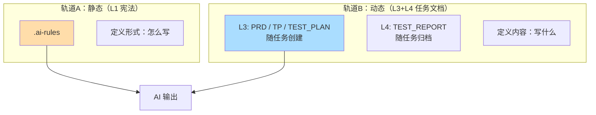
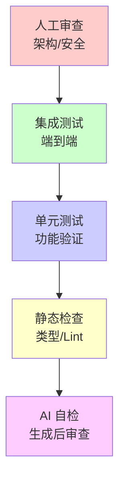

# Vibe Coding 完整参考指南

> AI 辅助编程的规范化方法论——让 AI 在明确边界内，按规范执行可控任务。

---

## 目录

1. [核心理念](#1-核心理念)
2. [核心方法论](#2-核心方法论)
3. [提示词格式规范](#3-提示词格式规范)
4. [项目文件组织](#4-项目文件组织)
5. [实战案例](#5-实战案例)
6. [常见问题与检查清单](#6-常见问题与检查清单)

---

## 1. 核心理念

### 1.1 范式转移


### 1.2 核心定义

**规范驱动开发（Spec-Driven Development, SDD）** = 在编写任何代码之前，先由人类和 AI 共同创建一份清晰、机器可读的**规范（Specification）**，作为项目唯一的"真相来源"。

### 1.3 为什么需要规范？

| 问题 | 表现 | 解决方案 |
|------|------|---------|
| **范围蔓延** | AI 自动添加不需要的功能 | 明确"不做什么" |
| **技术偏离** | AI 使用不熟悉的技术栈 | 固化技术边界 |
| **风格混乱** | 不同会话生成不同风格 | 统一代码规范 |
| **上下文丢失** | AI 忘记之前的约定 | 文档作为唯一真相 |

---

## 2. 核心方法论

### 方法论与文件映射总览

```
┌─────────────────────────────────────────────────────────────────┐
│                      六大方法论 → 文件映射                        │
├─────────────────────────────────────────────────────────────────┤
│                                                                  │
│  1. 控制边界 ─────────────→ .boundary/                           │
│  2. 文档驱动 ─────────────→ docs/ + AGENTS.md                    │
│  3. 任务拆分 ─────────────→ TASKS.md 或融入 PRD/TP               │
│  4. 迭代反馈 ─────────────→ Git + tests/                        │
│  5. 上下文管理 ────────────→ AGENTS.md + .aiignore               │
│  6. 质量验证 ──────────────→ TEST_PLAN.md + TEST_REPORT.md       │
│                                                                  │
└─────────────────────────────────────────────────────────────────┘
```

---

### 2.1 控制边界（Boundary Control）

| 边界类型 | 约束内容 | 对应文件 |
|---------|---------|---------|
| **资源边界** | 时间、成本、人力 | `.boundary/resources.md` |
| **目标边界** | 做什么、不做什么 | `.boundary/scope.md` |
| **技术边界** | 技术栈、框架 | `.boundary/tech-stack.md` |
| **质量边界** | 质量标准 | `.boundary/quality.md` |

**边界文件示例**：
```markdown
# .boundary/scope.md

## 做什么
- 用户登录（邮箱+密码）
- JWT 认证

## 不做什么
- ~~第三方登录~~
- ~~密码找回~~
```

---

### 2.2 文档驱动 + 规则文件

#### 文档层次与双轨架构



#### 文档层次说明

| 层次 | 生命周期 | 轨道 | 文件名称 | 创建方式 |
|------|---------|------|---------|---------|
| **L1 宪法** | 长期不变 | 轨道A | `.ai-rules` | 人工填写 |
| **L2 全局** | 长期不变 | 轨道A | README.md | 人工填写 |
| **L3 规范** | 随任务创建 | 轨道B | PRD.md, TP.md, TEST_PLAN.md | AI 生成 |
| **L4 记录** | 随任务归档 | 轨道B | TEST_REPORT.md | AI 生成 |

#### .ai-rules 规则文件的作用

```
.ai-rules = L1 项目宪法 = AI 行为规则

作用：让 AI 每次会话开始时读取，确保风格一致

内容来源：
├── 技术栈约束      （来自 .boundary/tech-stack.md）
├── 代码规范        （命名、风格、架构模式）
├── 质量标准        （测试要求、错误处理）
└── 工作流程        （如何处理任务）
```

---

### 2.3 任务拆分（Decomposition）

| 文件 | 作用 | 内容 |
|------|------|------|
| **TASKS.md** | 任务清单 | 原子任务列表、优先级、状态 |
| **PRD.md** | 功能拆分 | 用户故事 → 功能点 |
| **TP.md** | 技术拆分 | 模块设计、接口定义 |

**TASKS.md 示例**：
```markdown
# 任务清单

## 功能拆分
目标：提醒助手
    ├── 提醒管理
    │   ├── 任务1：设计数据模型 [P0]
    │   ├── 任务2：实现 CRUD API [P0]
    │   └── 任务3：输入验证 [P1]
    ├── 定时调度
    └── 通知发送

## 原子任务清单
- [x] 任务1：设计数据模型（15分钟）
- [ ] 任务2：实现 CRUD API（30分钟）
- [ ] 任务3：输入验证（15分钟）
```

---

### 2.4 迭代反馈（Iterative Feedback）

| 反馈层次 | 体现方式 | 文件/记录 |
|---------|---------|----------|
| **秒级** | 编辑器实时检查 | 无文件 |
| **分钟级** | 测试执行 | `tests/`, pytest output |
| **小时级** | 功能完成报告 | `TEST_REPORT.md` |

**微提交记录**：
```
Git commit 历史：
feat(models): 定义 Reminder 数据模型
test(scheduler): 添加调度器单元测试
fix(notifier): 修复 Windows 通知失败
```

---

### 2.5 上下文管理（Context Management）

| 上下文类型 | 文件位置 | 说明 |
|-----------|---------|------|
| **项目上下文** | `AGENTS.md` | 全局规则，每次会话读取 |
| **边界上下文** | `.boundary/*.md` | 约束条件 |
| **任务上下文** | `docs/PRD.md`, `docs/TP.md` | 手动引用 |
| **排除规则** | `.aiignore` | 精简上下文 |

**.aiignore 示例**：
```
# 排除无关文件，精简 AI 上下文
node_modules/
dist/
.git/
*.log
```

---

### 2.6 质量验证（Quality Validation）

| 验证阶段 | 输入文件 | 输出文件 |
|---------|---------|---------|
| **计划** | PRD.md, TP.md | TEST_PLAN.md |
| **执行** | TEST_PLAN.md | tests/*.py |
| **报告** | 测试结果 | TEST_REPORT.md |



---

## 3. 提示词格式规范

### 3.1 统一格式结构

| 部分 | 说明 |
|------|------|
| **Context** | 需要读取的文件列表 |
| **Work Path** | 输出文件的目录位置 |
| **Task** | 具体要做什么 |
| **Output Standard** | 结构、风格、质量要求 |
| **Action** | 具体的执行指令 |

### 3.2 提示词编写原则

| 原则 | 说明 | 示例 |
|------|------|------|
| **具体化** | 避免模糊描述 | ✓ "生成 PRD.md" |
| **可测试** | 验收标准可验证 | ✓ "返回 401 错误" |
| **简洁** | 表格/代码块为主 | 多用表格，少用段落 |
| **明确路径** | 文件路径清晰 | `<PROJECT_PATH>/docs/` |

---

## 4. 项目文件组织

### 4.1 标准目录结构

```
project/
├── .boundary/              # ① 控制边界
│   ├── scope.md           # 目标边界
│   ├── tech-stack.md      # 技术边界
│   └── resources.md       # 资源边界
│
├── .ai-rules              # ② 规则文件
├── .aiignore              # ③ 上下文管理
│
├── docs/                  # ④ 文档驱动 + 质量验证
│   ├── PRD_DRAFT.md       # 需求草稿（AI 生成）
│   ├── PRD.md             # 需求文档（AI 生成）
│   ├── TP.md              # 技术方案（AI 生成）
│   ├── TEST_PLAN.md       # 测试计划（AI 生成）
│   └── TEST_REPORT.md     # 测试报告（AI 生成）
│
├── TASKS.md               # ⑤ 任务拆分（可选，AI 生成）
│
├── src/                   # 源代码（AI 生成）
├── tests/                 # 测试代码（AI 生成）
└── data/                  # 数据文件（运行时生成）
```

### 4.2 文件分类

| 类型 | 文件 | 创建方式 | 说明 |
|------|------|---------|------|
| **边界文件** | `.boundary/*.md` | 人工填写 | 定义项目边界 |
| **规则文件** | `.ai-rules` | 人工填写 | 定义 AI 行为规则 |
| **排除规则** | `.aiignore` | 复制模板 | 排除无关文件 |
| **文档** | `docs/*.md` | AI 生成 | 需求、技术、测试文档 |
| **任务清单** | `TASKS.md` | AI 生成 | 原子任务拆分 |
| **代码** | `src/`, `tests/` | AI 生成 | 源代码和测试 |

---

## 5. 实战教程：通用项目开发流程

> 使用 opencode 开发任意项目的完整流程模板

### 教程概览

```
┌─────────────────────────────────────────────────────────────────────┐
│                         Vibe Coding 工作流                          │
├─────────────────────────────────────────────────────────────────────┤
│                                                                     │
│  阶段A：项目初始化（静态文件）                                        │
│  ┌─────────────────────────────────────────────────────────────┐   │
│  │  Prompt A → 创建目录 + 生成模板 + 对话填写                   │   │
│  └─────────────────────────────────────────────────────────────┘   │
│                              ↓                                      │
│  阶段B：文档生成（动态文档）                                          │
│  ┌─────────────────────────────────────────────────────────────┐   │
│  │  Prompt B → 需求/技术/任务/测试计划文档（逐个确认）            │   │
│  └─────────────────────────────────────────────────────────────┘   │
│                              ↓                                      │
│  阶段C：代码生成（TDD）                                               │
│  ┌─────────────────────────────────────────────────────────────┐   │
│  │  Prompt C → 测试代码(Red) → 工程代码(Green) → 测试报告        │   │
│  └─────────────────────────────────────────────────────────────┘   │
│                                                                     │
└─────────────────────────────────────────────────────────────────────┘
```

---

### 使用说明

1. **复制 Prompt** → 粘贴到 opencode
2. **对话确认** → 根据问题填写项目信息
3. **逐步确认** → 每个文档生成后确认再继续

---

### Prompt A：项目初始化

```text
# Vibe Coding 项目初始化

我要开发一个新项目，请帮我完成初始化。

## Task 1：创建项目结构

1. 首先问我项目名称和目录位置
2. 创建以下目录结构：
   - .boundary/
   - docs/
   - src/
   - tests/
   - data/（如需要）
3. 初始化 Git：git init

## Task 2：生成静态文件模板

请生成以下文件模板（保持结构完整，具体内容用占位符表示）：

1. `.boundary/scope.md` - 目标边界（做什么/不做什么/资源约束）
2. `.boundary/tech-stack.md` - 技术边界（技术栈/约束）
3. `.ai-rules` - AI 编程规则（角色定位/必须遵守/禁止行为）
4. `.aiignore` - 上下文排除规则

## Task 3：对话确认内容

生成模板后，请逐个文件向我提问，帮助我填写具体内容：

1. **scope.md**：询问我项目的功能范围、资源约束
2. **tech-stack.md**：根据功能推荐合适的技术栈，询问是否同意
3. **.ai-rules**：根据技术栈生成对应的代码规范，询问是否需要调整
4. **.aiignore**：根据技术栈生成合适的排除规则

## Task 4：确认并保存

所有文件填写完成后，请展示最终内容供我确认，确认后保存到对应文件。

---

请开始执行，首先询问项目名称。
```

---

### Prompt B：文档生成阶段

```text
# Vibe Coding 文档生成阶段

## Role
你是一位崇尚"轻量级文档"和"测试驱动开发 (TDD)"的高级工程师。
你的目标是协助我通过可控的文档节点，高质量地完成软件开发。

## Global Constraints
1. **文档优先**：每个阶段必须产出/更新指定的 Markdown 文档
2. **简洁性**：文档禁止冗长段落。使用 Bullet points、表格、代码块
3. **TDD 原则**：在工程代码开发前，必须先有失败的测试代码
4. **逐个确认**：每生成一个文档后，暂停并等待我确认

---

## Step 1：需求文档 (docs/PRD.md)

### Context
读取并理解以下文件：
- `.boundary/scope.md` - 目标边界

### Work path
<PROJECT_PATH>/docs

### Task
将需求草稿转化为正式的、可测试的需求文档。

### Output Standard (`PRD.md`)
1. **结构**：
   - 1. 项目目标（一句话）
   - 2. 功能清单（表格：功能点 | 优先级 | 验收标准）
   - 3. 数据流向（Mermaid 流程图）
   - 4. 边界条件（异常处理要求）
2. **风格**：验收标准必须是可测试的（如"返回 401 错误"而非"报错"）

### Action
生成 `PRD.md`。完成后暂停等待我确认。

---

## Step 2：技术方案 (docs/TP.md)

### Context
读取并理解以下文件：
- `docs/PRD.md` - 需求文档
- `.boundary/tech-stack.md` - 技术边界

### Work path
<PROJECT_PATH>/docs

### Task
设计实现方案，重点在于数据结构、接口定义和核心算法选型。

### Output Standard (`TP.md`)
1. **结构**：
   - 1. 技术栈（语言/框架/版本）
   - 2. 目录结构（Tree 格式）
   - 3. 数据模型（Schema 定义或 Interface 定义）
   - 4. 核心 API 设计（Method | Path | Request | Response）
   - 5. 关键难点解决方案
2. **风格**：多用代码块定义 Interface/Schema，少用文字描述
3. **约束**：不包含具体业务逻辑实现代码，只定义契约

### Action
生成 `TP.md`。如有技术选型风险，请在此阶段提出。完成后暂停等待我确认。

---

## Step 3：任务清单 (TASKS.md)

### Context
读取并理解以下文件：
- `docs/PRD.md` - 需求文档
- `docs/TP.md` - 技术方案

### Work path
<PROJECT_PATH>/

### Task
按 MECE 原则将功能拆分为原子任务，标注优先级和预估时间。

### Output Standard (`TASKS.md`)
1. **结构**：
   - 功能拆分树（缩进表示层级）
   - 原子任务清单（表格：- [ ] 任务名 | 优先级 | 预估时间 | 状态）
2. **要求**：
   - 每个任务可在 30 分钟内完成
   - 明确任务依赖关系

### Action
生成 `TASKS.md`。完成后暂停等待我确认。

---

## Step 4：测试计划 (docs/TEST_PLAN.md)

### Context
读取并理解以下文件：
- `docs/PRD.md` - 需求文档（含验收标准）
- `docs/TP.md` - 技术方案（含接口定义）

### Work path
<PROJECT_PATH>/docs

### Task
制定测试策略，映射每一个功能点到具体的测试用例。

### Output Standard (`TEST_PLAN.md`)
1. **结构**：
   - 1. 测试策略（单元/集成/E2E 比例）
   - 2. 用例清单（表格：ID | 关联需求 | 测试场景 | 预期结果 | 优先级）
   - 3. Mock 策略（哪些外部依赖需要 Mock）
2. **风格**：表格为主。预期结果必须具体

### Action
生成 `TEST_PLAN.md`。完成后暂停等待我确认。

---

## Step 5：测试代码 (tests/)

### Context
读取并理解以下文件：
- `docs/TEST_PLAN.md` - 测试计划
- `docs/TP.md` - 技术方案（含接口定义）

### Work path
<PROJECT_PATH>/tests

### Task
根据测试计划编写测试用例文件。

### Output Standard
1. **代码规范**：测试代码需包含清晰的 Arrange-Act-Assert 结构
2. **完整性**：测试代码结构完整，可运行
3. **注释**：在测试函数名中体现测试场景（如 `test_login_should_fail_with_wrong_password`）

### Action
输出测试代码。完成后暂停等待我确认。

---

请开始 Step 1。
```

---

### Prompt C：TDD 代码生成

```text
# Vibe Coding TDD 代码生成

## Step 1：实现工程代码 (Green)

### Context
读取并理解以下文件：
- `docs/TP.md` - 技术方案
- `tests/` - 测试代码
- `.ai-rules` - AI 编程规则

### Work path
<PROJECT_PATH>/src
<PROJECT_PATH>/docs

### Task
1. 实现逻辑：编写业务代码，目标仅是让测试通过 (Green)
2. 最小化：不要过度设计，只实现当前测试需要的功能
3. 重构：测试通过后，优化代码结构，消除重复
4. 验证：确保所有测试用例 PASS（绿条）

### Output Standard
1. **代码规范**：遵循 `.ai-rules` 中定义的规范，类型提示完整
2. **注释**：只注释"为什么这么做"，不要注释"做了什么"
3. **同步**：如果实现过程中修改了技术方案，同步更新 `docs/TP.md`

### Action
输出工程代码文件内容。指导我运行测试并确认全部通过。

---

## Step 2：生成测试报告 (docs/TEST_REPORT.md)

### Context
- 测试已通过
- 读取 `docs/PRD.md`（含验收标准）

### Work path
<PROJECT_PATH>/docs

### Task
基于测试结果和 PRD 的验收标准，生成验收报告。

### Output Standard (`TEST_REPORT.md`)
1. **结构**：
   - 1. 测试总结（通过率/覆盖率）
   - 2. 需求覆盖矩阵（表格：PRD 需求 | 测试状态 | 备注）
   - 3. 性能/安全简要评估
   - 4. 发布建议（Go/No-Go）
   - 5. 遗留问题清单
2. **风格**：数据驱动，结论明确
3. **简洁**：不超过 2 页

### Action
生成 `TEST_REPORT.md`。

---

请开始执行。
```

---

### 最终目录结构

```
project-name/
├── .boundary/              # Prompt A 生成
│   ├── scope.md           # 对话填写
│   └── tech-stack.md      # 对话填写
│
├── .ai-rules              # Prompt A 生成（对话填写）
├── .aiignore              # Prompt A 生成
│
├── docs/                  # Prompt B 生成
│   ├── PRD.md            # Step 1
│   ├── TP.md             # Step 2
│   ├── TEST_PLAN.md      # Step 4
│   └── TEST_REPORT.md    # Prompt C 生成
│
├── TASKS.md               # Prompt B Step 3
├── tests/                 # Prompt B Step 5
├── src/                   # Prompt C Step 1
└── .git/
```

---

## 6. 常见问题与检查清单

### 6.1 常见问题

| 问题 | 原因 | 解决方案 |
|------|------|---------|
| AI 风格不一致 | 缺乏统一规范 | 完善 AGENTS.md，每次会话读取 |
| AI 忘记约定 | 依赖对话历史 | 将约定写入文档文件 |
| AI 过度设计 | 边界不清晰 | scope.md 明确"不做什么" |
| 生成代码不安全 | 缺少安全约束 | AGENTS.md 添加安全要求 |
| 上下文超出 | 文件太多 | 使用 .aiignore 排除 |
| 测试不过就跑路 | 缺少检查点 | 微提交 + 检查点机制 |

### 6.2 快速检查清单

| 阶段 | 检查项 |
|------|--------|
| **开发前** | `.boundary/` 文件已创建<br>`AGENTS.md` 已定义规则<br>`docs/` 目录已初始化 |
| **开发中** | 每个任务有明确验收标准<br>完成后立即提交代码<br>保持文档与代码同步 |
| **开发后** | 所有测试 PASS<br>代码通过类型检查<br>文档已更新<br>生成测试报告 |

---

*版本：v1.0*
*更新：2026-03-02*
