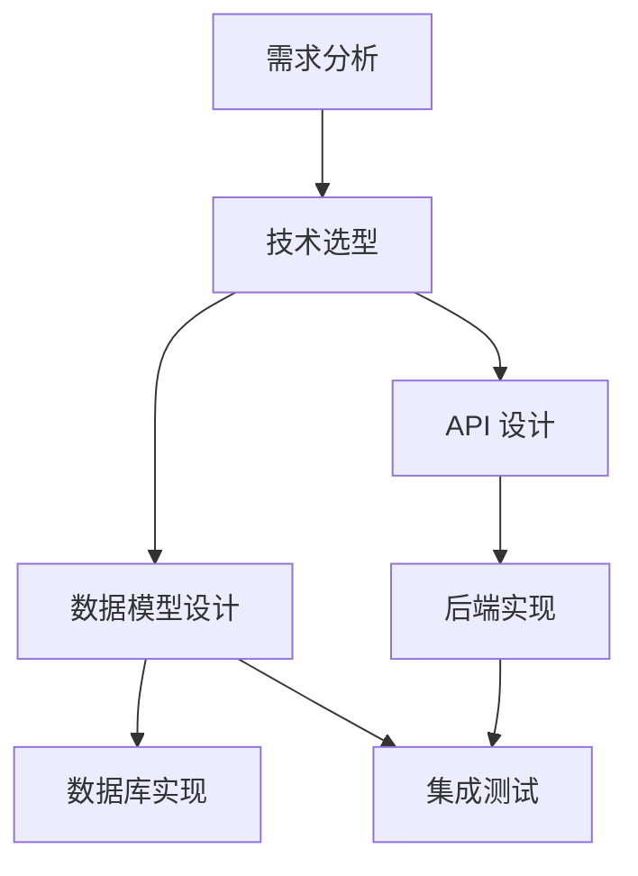

# Vibe Coding 系统方法论：从实践到规范

> 基于国内外最佳实践整理的完整方法论指南，涵盖文档驱动开发、任务拆分、边界控制三大核心要素。

---

## 目录

1. [核心理念：从"代码为王"到"规范为王"](#核心理念)
2. [三大核心要素](#三大核心要素)
3. [文档驱动开发(DDD/SDD)完整方法论](#文档驱动开发)
4. [任务拆分与边界控制](#任务拆分)
5. [工程化实践与工具链](#工程化实践)
6. [完整工作流模板](#完整工作流)

---

## 核心理念：从"代码为王"到"规范为王"

### 范式转移

```
传统开发：代码是唯一真相来源
Vibe Coding：聊天对话 + AI 生成
规范驱动开发：规范是唯一真相来源，AI 按规范执行
```

### 核心定义

**规范驱动开发（Spec-Driven Development, SDD）** = 在编写任何代码之前，先由人类和AI共同创建一份清晰、机器可读的**规范（Specification）**，作为项目唯一的"真相来源"。

| 维度 | Vibe Coding | Spec-Driven Development |
|------|-------------|------------------------|
| 输入 | 随性自然语言描述 | 结构化规范文档 |
| 输出 | 不可预测的代码 | 可验证、可追溯的代码 |
| 质量控制 | 事后测试 | 规范即测试契约 |
| 可维护性 | 聊天记录散落 | 规范文档集中管理 |

---

## 三大核心要素

### 1. 控制边界（Boundary Control）

#### 为什么要控制边界？

AI 的创造力需要围栏，否则会：
- **范围蔓延**：自动添加你不需要的功能
- **技术偏离**：使用你不熟悉的技术栈
- **过度工程**：为"可能需要"的功能写代码

#### 边界控制的三个层次

**（1）资源边界**
```
时间边界：本次会话最多 2 小时
预算边界：API 调用成本不超过 $5
人力边界：我会在 30 分钟内审查一次
```

**（2）目标边界**
```
明确做什么：
- 实现用户登录功能（邮箱+密码）
- 支持 JWT 认证
- 登录状态保持 7 天

明确不做什么（同样重要！）：
- 不支持第三方登录
- 不支持手机号登录
- 不实现密码找回功能
```

**（3）技术边界**
```
技术栈约定：
- 后端：Python + FastAPI
- 前端：React + TypeScript
- 数据库：PostgreSQL
- 不允许引入新的框架（除非讨论确认）
```

### 2. 拆分整合（Decomposition & Integration）

#### 拆分原则：MECE法则

**MECE = Mutually Exclusive, Collectively Exhaustive**
（相互独立，完全穷尽）

```
错误拆解：
├── 前端
├── 后端
└── 数据库
（问题："登录功能"该放哪？）

正确拆解：
├── 用户注册
│   ├── 输入验证
│   ├── 密码加密
│   └── 数据存储
├── 用户登录
│   ├── 凭证验证
│   ├── 令牌生成
│   └── 会话管理
└── 用户登出
    ├── 令牌失效
    └── 会话清理
```

#### 任务拆分的四个维度

| 维度 | 方法 | 示例 |
|------|------|------|
| **顺序分解** | 按流程自然拆分 | 注册 → 登录 → 登出 |
| **树状分解** | 层级展开 | 认证 → 用户/管理员/第三方 |
| **角色分解** | 按角色分工 | 产品/设计/开发/测试 |
| **递归分解** | 继续拆分直到原子级 | 模块 → 组件 → 函数 → 代码行 |

#### 原子任务的定义

一个原子任务应该满足：
```
✅ 可以在 30 分钟内完成
✅ 可以独立验证
✅ 有明确的输入和输出
✅ 不依赖其他未完成的任务
```

### 3. 文档驱动（Document-Driven）

#### 文档的四个层次

```
Level 1: 项目宪法（Constitution）
    ├── 技术栈约束
    ├── 代码规范
    └── 质量标准

Level 2: 全局上下文（AGENTS.md / project.md）
    ├── 项目结构
    ├── 工作流程
    └── 开发环境

Level 3: 变更提案（Proposal）
    ├── 背景（Why）
    ├── 范围（What）
    └── 方法（How）

Level 4: 具体规范（Spec）
    ├── 数据契约（JSON Schema）
    ├── 行为契约（Gherkin 场景）
    ├── 接口契约（OpenAPI）
    └── 架构契约（ADR）
```

#### 双轨并行架构

```
┌─────────────────────────────────────────────────────┐
│              双轨并行（Two-Track Parallel）           │
├─────────────────────────────────────────────────────┤
│  轨道A（全局静态轨）          轨道B（局部动态轨）      │
│  ┌──────────────────┐      ┌──────────────────┐    │
│  │  AGENTS.md       │      │  docs/login.md   │    │
│  │  Project Rules   │      │  specs/xxx.spec  │    │
│  │  长期有效        │      │  随任务创建/归档  │    │
│  └──────────────────┘      └──────────────────┘    │
│         ↓                         ↓                   │
│    定义形式（Form）           定义内容（Content）      │
└─────────────────────────────────────────────────────┘
```

---

## 文档驱动开发

### 完整工作流

```
┌──────────────┐
│ 1. 澄清需求   │  /clarify 或 /explore
│   Clarify     │  理解问题，明确目标
└───────┬───────┘
        ↓
┌──────────────┐
│ 2. 定义规范   │  /specify
│   Specify     │  输出：spec.md（需求+验收标准）
└───────┬───────┘
        ↓
┌──────────────┐
│ 3. 技术设计   │  /plan
│   Plan        │  输出：plan.md（技术栈+架构）
└───────┬───────┘
        ↓
┌──────────────┐
│ 4. 任务分解   │  /tasks
│   Tasks       │  输出：tasks.md（可执行清单）
└───────┬───────┘
        ↓
┌──────────────┐
│ 5. AI 实施    │  /apply
│   Implement   │  AI 按任务清单执行
└───────┬───────┘
        ↓
┌──────────────┐
│ 6. 验证归档   │  /archive
│   Archive     │  合并规范，清理工作区
└──────────────┘
```

### 规范文档的标准格式

#### Spec 文件模板

```markdown
# [功能名称] 规范

## 1. 需求概述（Requirements）

### 1.1 功能需求
The system SHALL [使用强约束词]:
- MUST: 必须满足
- SHOULD: 应该满足
- MAY: 可以满足

### 1.2 验收场景（Gherkin 格式）

#### Scenario: 成功登录
- **GIVEN** 用户已注册且邮箱和密码正确
- **WHEN** 用户提交登录表单
- **THEN** 系统返回一个有效的会话令牌
- AND 令牌有效期为 7 天

#### Scenario: 密码错误
- **GIVEN** 用户已注册但提交了错误密码
- **WHEN** 用户提交登录表单
- **THEN** 系统返回"用户名或密码错误"提示
- AND 记录失败尝试

## 2. 数据契约（Data Contract）

```json
{
  "LoginRequest": {
    "type": "object",
    "properties": {
      "email": {"type": "string", "format": "email"},
      "password": {"type": "string", "minLength": 8}
    },
    "required": ["email", "password"]
  }
}
```

## 3. 接口契约（API Contract）

### POST /api/auth/login

**请求：**
```json
{
  "email": "user@example.com",
  "password": "hashed_password"
}
```

**响应（200 OK）：**
```json
{
  "token": "jwt_token_here",
  "expires_in": 604800
}
```

**响应（401 Unauthorized）：**
```json
{
  "error": "INVALID_CREDENTIALS"
}
```

## 4. 非功能需求

- 性能：登录响应时间 < 500ms（P95）
- 安全：密码必须使用 bcrypt 加密，cost factor ≥ 12
- 可用性：登录服务可用性 ≥ 99.9%

## 5. 边界条件

- 网络超时：5 秒
- 并发限制：同一用户每分钟最多 5 次登录尝试
- 账户锁定：连续失败 5 次后锁定 15 分钟
```

---

## 任务拆分

### 任务拆分的三步法

#### 第一步：目标到功能的纵向拆解

```
目标：开发一个电商网站
    ↓
├── 用户管理（注册、登录、个人中心）
├── 商品管理（列表、详情、搜索）
├── 购物车（添加、删除、结算）
├── 订单管理（创建、支付、查询）
└── 后台管理（商品上架、订单处理）
```

#### 第二步：功能到任务的横向拆解

```
用户登录功能
    ↓
├── 任务1：设计登录 UI（优先级：P0，复杂度：低）
├── 任务2：实现登录 API（优先级：P0，复杂度：中）
├── 任务3：集成 JWT 认证（优先级：P0，复杂度：中）
├── 任务4：添加登录验证（优先级：P1，复杂度：低）
└── 任务5：实现登出功能（优先级：P1，复杂度：低）
```

#### 第三步：任务到步骤的递归拆解

```
任务：实现登录 API
    ↓
├── 步骤1：定义用户模型（5分钟）
├── 步骤2：实现密码加密函数（10分钟）
├── 步骤3：实现登录端点（15分钟）
├── 步骤4：实现 JWT 生成（10分钟）
└── 步骤5：编写单元测试（15分钟）
```

### 关键路径优先原则

**原则**：先做关键路径上的任务，并行处理非关键任务

```
关键路径（串行）：
用户注册 → 创建数据库 → 实现API → 前端集成

并行任务（可同时进行）：
├── UI 设计
├── 文档编写
└── 测试用例准备
```

### 任务依赖关系图



---

## 工程化实践

### 工具链对比

| 工具 | 定位 | 核心特点 | 适用场景 |
|------|------|----------|----------|
| **Spec-Kit** | GitHub 官方 | 四阶段流程，AI 驱动 | 从 0 到 1 的新项目 |
| **OpenSpec** | 轻量级 CLI | 提案→实施→归档 | 已有项目的功能演进 |
| **AGENTS.md** | 规范文件 | 项目级规则定义 | 所有 AI 编码工具通用 |
| **Superpowers** | 方法论工具 | 结构化思维框架 | 团队知识库沉淀 |

### AGENTS.md 标准模板

```markdown
# AI 编程助手规则

## 1. 项目概述
- 名称：[项目名称]
- 技术栈：[列出主要技术]
- 目标：[一句话描述项目目标]

## 2. 开发环境
- 构建命令：`npm run dev`
- 测试命令：`npm test`
- Lint 命令：`npm run lint`

## 3. 代码规范
- 使用 TypeScript Strict Mode
- 函数优先级：纯函数 > 箭头函数 > 传统函数
- 命名约定：驼峰式（camelCase）用于变量，帕斯卡式（PascalCase）用于类型

## 4. 工作流程
1. 阅读 AGENTS.md 了解项目规则
2. 每次对话专注于单个原子任务
3. 完成后更新 tasks.md 标记进度
4. 提交代码前必须运行测试

## 5. 禁止行为
- 禁止修改 node_modules/、dist/、build/ 目录
- 禁止提交敏感信息（API 密钥、密码）
- 禁止引入未经讨论的第三方库

## 6. 测试策略
- 单元测试覆盖率要求：> 80%
- 关键业务逻辑必须有集成测试

## 7. 文档规范
- API 变更需要更新 api.md
- 新增功能需要更新 README.md
```

### 项目宪法（Constitution）模板

```markdown
# 项目宪法

## 质量原则
- 代码可读性 > 代码简洁性
- 测试覆盖率 > 功能完整性
- 安全性 > 性能

## 技术约束
- 前端必须使用 TypeScript
- 后端 API 必须返回 JSON 格式
- 数据库操作必须使用 ORM/Query Builder

## 工作流程约束
- 任何功能开发必须先写规范
- 代码审查通过后才能合并
- 所有 API 变更需要向后兼容

## 验收标准
- 新功能必须有单元测试
- 代码必须通过 ESLint 检查
- 文档必须同步更新
```

---

## 完整工作流模板

### 最小可执行模板（Lite 版）

适用于个人开发、原型验证、极速迭代：

```
┌─────────────────────────────────────────────────────┐
│                   30 分钟快速闭环                    │
├─────────────────────────────────────────────────────┤
│  0-3min   初始化：给 AI 一份"家规"约束               │
│           （ constitution.md 或 AGENTS.md ）        │
│                                                     │
│  3-10min  需求澄清：让 AI 出 spec 文档               │
│           （ In/Out + AC + 约束条件）                 │
│                                                     │
│  10-15min 任务规划：让 AI 更新到文档中              │
│           （可执行步骤 + 验证标准）                  │
│                                                     │
│  15-25min 分步实施：按规范写代码 + 最小单测          │
│                                                     │
│  25-30min 审查归档：人工 review + 文档更新          │
└─────────────────────────────────────────────────────┘
```

### 标准版（Team Mode）

适用于多人协作、复杂业务逻辑、需要长期维护的项目：

```
┌─────────────────────────────────────────────────────┐
│                  完整 Requirements →              │
│                  Interface →                       │
│                  Implementation 链路                │
├─────────────────────────────────────────────────────┤
│                                                      │
│  阶段1：需求（Requirements）                         │
│  ├─ 用户故事                                       │
│  ├─ 验收标准（Acceptance Criteria）                │
│  └─ 边界条件                                       │
│                                                      │
│  阶段2：接口（Interface）                             │
│  ├─ API 规范（OpenAPI/Swagger）                   │
│  ├─ 数据模型（ER Diagram / JSON Schema）            │
│  └─ 服务契约（Service Contract）                    │
│                                                      │
│  阶段3：实施计划（Implementation Plan）               │
│  ├─ 架构设计                                       │
│  ├─ 技术选型                                       │
│  └─ 任务分解                                       │
│                                                      │
│  阶段4：开发与验证（Development & Validation）        │
│  ├─ AI 编码                                        │
│  ├─ 单元测试                                       │
│  └─ 集成测试                                       │
│                                                      │
│  阶段5：审查与交付（Review & Delivery）               │
│  ├─ 代码审查                                       │
│  ├─ 文档更新                                       │
│  └── 归档                                          │
│                                                      │
└─────────────────────────────────────────────────────┘
```

---

## 实战检查清单

### 开始开发前

- [ ] 是否已创建 AGENTS.md 或 Constitution？
- [ ] 是否已明确本次开发的边界（时间/资源/目标）？
- [ ] 是否已将大任务拆解为原子任务？
- [ ] 是否已识别关键路径？

### 开发过程中

- [ ] 每个任务是否有明确的验收标准？
- [ ] 是否在完成后立即提交代码（Micro-commits）？
- [ ] 是否保持了文档与代码的同步？
- [ ] 是否定期运行测试验证？

### 完成后

- [ ] 代码是否通过所有测试？
- [ ] 文档是否已更新？
- [ ] 规范是否已归档？
- [ ] 是否进行了复盘总结？

---

## 参考资源

### 开源项目
- [spec-kit](https://github.com/github/spec-kit) - GitHub 官方 SDD 工具
- [OpenSpec](https://github.com/Fission-AI/openspec) - 轻量级规范驱动开发
- [agents.md](https://github.com/agentsmd/agents.md) - AI 编码代理规范

### 推荐阅读
- [AI时代的软件工程：如何用 OpenSpec 驱动"全自动"开发](https://xuzeyu.blog.csdn.net/article/details/151232624)
- [Spec-Driven Development为混乱的AI编程增加工程纪律](https://baijiahao.baidu.com/s?id=1853948003820851337)
- [AGENTS.md：AI 编程，给它份"操作手册"](https://www.toutiao.com/a7583903892325368346/)

---

*文档版本：v1.0*
*更新日期：2026-03-02*
